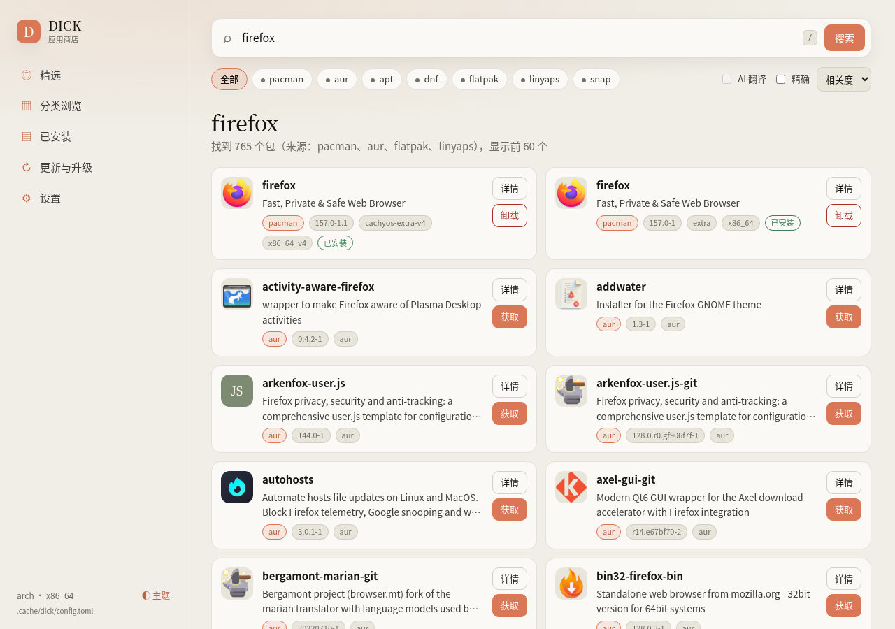
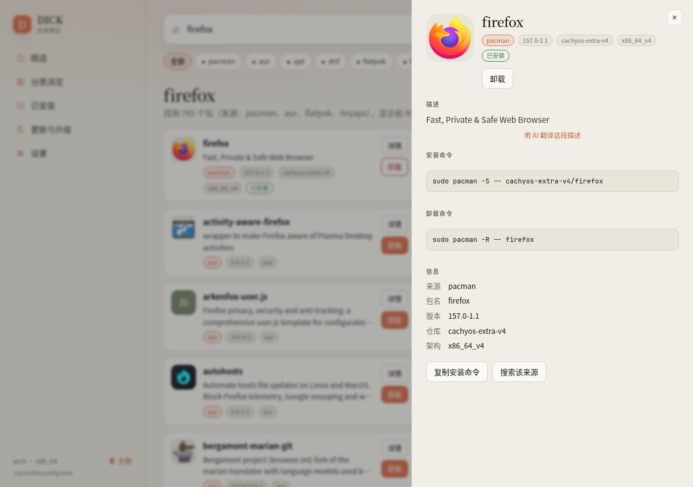
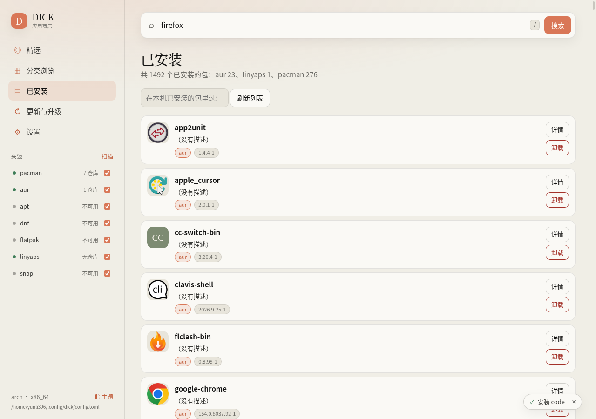
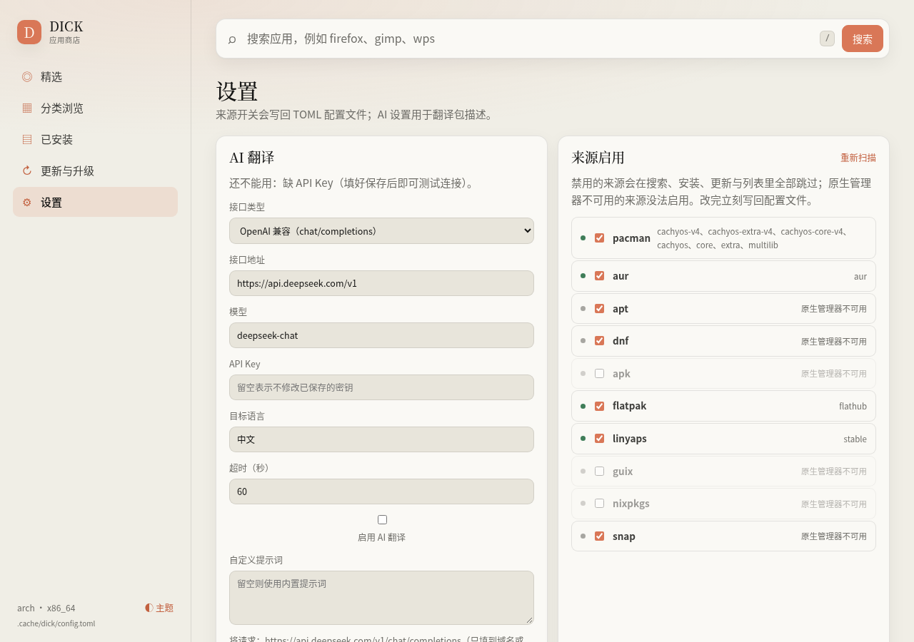

# DICK — Detective Index Collection Kit

一个依赖python基础库的，管理所有软件包管理器的工具

## 安装与运行

需要 **Python 3.11+**。（仅在Python 3.11经过测试）

### 一键安装

```bash
curl -fsSL https://raw.githubusercontent.com/yunli396/Dick/main/install.sh | bash
```

脚本同时可用于更新。装好之后，更新和卸载也可以直接交给 DICK 自己：

```bash
dick updateme             # 更新 DICK 自己（git pull + 重装进 venv）
dick updateme --dry-run   # 只看会执行哪些命令
dick updateme --ref dev   # 换到别的分支或标签
dick removeme             # 卸载 DICK（默认保留 ~/.config/dick 里的配置）
dick removeme --purge     # 连配置与缓存一起删
```

`updateme` / `removeme` 只认 install.sh 装出来的目录结构（`<前缀>/share/dick/{venv,src}` 与 `<前缀>/bin/dick` 软链，默认前缀 `~/.local`，可用 `--prefix` 指定）。从源码工作区直接跑时，`updateme` 就是 `git pull --ff-only`，`removeme` 会拒绝执行并说明原因——它不会去删你的工作区；装在系统 Python 里的 DICK 会告诉你该用哪个包管理器。卸载需要交互确认，脚本里请显式加 `--yes`。

也可以用安装脚本本身卸载：

```bash
curl -fsSL https://raw.githubusercontent.com/yunli396/Dick/main/install.sh | bash -s -- --uninstall
```

### 手动安装

从源码目录安装（也可以 `pipx install .`）：

```bash
python -m pip install .
dick --help
dick source list
dick source scan
dick search firefox
dick list --source pacman
dick install firefox --dry-run
dick install firefox
dick upgrade
dick web
```

不安装也可以在项目目录运行 `python -m dick`。项目仅依赖 Python 标准库。

## 界面

`dick web` 出来的样子：


首页是类似Microsoft Store的界面。索引里没有的包会退回同名搜索：





底部任务面板把原生管理器的输出实时回灌进来——安装前先演练命令，确认后才真的执行，需要提权时会问一次 sudo 密码：





## 命令

| 命令 | 作用 |
| --- | --- |
| `dick source list` | 读取配置文件，列出来源、启用状态与 |
| `dick source scan` | 重新探测仓库 |
| `dick source enable pacman` | 启用来源 |
| `dick source disable snap` | 禁用来源 |
| `dick install <包> [--source X]` | 按来源安装，可输入多个 |
| `dick remove <包> [--deep]` | 扫描本机已安装列表，列出同名/相似名候选后卸载 |
| `dick list [关键词] [--source X]` | 列出本机已安装的包 |
| `dick search <关键词> [--source X] [--exact]` | 搜索索引与缓存 |
| `dick update [--source X]` | 刷新索引与缓存 |
| `dick upgrade [--source X]` | 升级 |
| `dick updateme [--ref 分支] [--prefix 路径]` | 更新 DICK 自己（install.sh 装法：git + pip；源码工作区：`git pull --ff-only`） |
| `dick removeme [--purge] [--prefix 路径]` | 卸载 DICK 自己；默认保留配置，`--purge` 连配置与缓存一起删 |
| `dick web [--host H] [--port P] [--open] [--tls\|--no-tls] [--token T\|--no-token]` | 启动本地 Web GUI，默认 `http://127.0.0.1:3907` |

全局选项：`--source`（可重复）、`--json`、`--dry-run`、`-y` / `--yes` / `--noconfirm`、`--exact`（搜索只做精确匹配，同时匹配 ID 别名）、`--deep`（仅 `remove`，连带清理依赖与配置）、`--limit`（每个来源显示上限，默认 50）、`--jobs`、`--config`、`--cache-dir`、`--root`、`--prefix` / `--ref` / `--purge`（仅 `updateme` / `removeme`）、`--host` / `--port` / `--open` / `--tls` / `--token` / `--no-token`（仅 `web`）、`--version`、`-h`。

## 来源支持

| 来源 | 搜索数据 | 本机列表 / 卸载 | 原生安装 | 当前范围 |
| --- | --- | --- | --- | --- |
| Pacman | `pacman.conf` 和递归 `Include` 中的 `Server` → `.db` | `pacman -Qn` / `pacman -R [-Rns]` | `pacman -S repo/name` | 首要链路，多镜像失败自动切换，zstd/gzip/xz/bzip2/未压缩 tar |
| AUR | 官方 RPC v5 的 search/info | `pacman -Qm` / `pacman -R [-Rns]` | `paru` 或 `yay` | Arch 上按需查询，默认缓存 15 分钟；不自行下载或构建 PKGBUILD |
| Flatpak | `flatpak remotes`、`flatpak remote-ls --json`（老版本退回 TSV） | `flatpak list --app` / `flatpak uninstall` | `flatpak install remote ID` | 已配置远端的应用，默认 Flatpak 安装作用域；`remote-ls` 不给描述与版本（1.18 起不认识的列会被静默丢弃），所以描述退回应用显示名 |
| APT | `.list` / Deb822 `.sources` → 各组件与架构的 `Packages` | `dpkg-query -W` / `apt-get remove\|purge` | `apt-get install` | 基础实现，xz/gzip/未压缩索引、平铺仓库、多文件合并 |
| DNF | `.repo` → `repomd.xml` → primary XML | `rpm -qa` / `dnf remove` | `dnf install` | 基础实现，baseurl/mirrorlist/metalink、元数据 checksum、架构筛选 |
| APK（Alpine） | `/etc/apk/repositories` → `{架构}/APKINDEX.tar.gz` 内的 `APKINDEX` | `/lib/apk/db/installed` / `apk del` | `apk add --no-cache` | Alpine 原生索引，解析单字母字段（`P`/`V`/`T`/`A`）；`@tag` 标记会被忽略，仓库名取 URL 末两段（`v3.20/main`） |
| Snap | `snap find` 的列表输出 | `snap list` / `snap remove` | `snap install` | 已安装 Snap 时按需查询，查询缓存默认 15 分钟 |
| Linyaps | `ll-cli --json search` 的 JSON | `ll-cli --json list --type=app` / `ll-cli uninstall` | `ll-cli install ID` | 已安装 `ll-cli` 时按需查询，查询缓存默认 15 分钟；仓库来自 `ll-cli --json repo show`，读取失败时退化为单一 `linglong` 仓库 |
| Guix | `guix package -A <正则>` 的四列表格 | `guix package --list-installed` / `guix remove` | `guix install` | 已安装 `guix` 时按需查询，查询缓存默认一天（`[cache.query_ttl]`）；查询按包名匹配（大小写不敏感），`-A` 不输出描述，所以描述列为空；装进用户自己的 profile，不加 sudo |
| Nixpkgs | `nix search --json nixpkgs <正则>` | `nix profile list --json` / `nix profile remove` | `nix profile install nixpkgs#名称` | 已安装 Nix 时按需查询，查询缓存默认一天（`[cache.query_ttl]`）；需要 Nix 2.4+ 的新 CLI（flake），未开启 `experimental-features = nix-command flakes` 时会给出提示；属性路径去掉 `legacyPackages.<系统>.` 前缀当名称；装进用户 profile，不加 sudo |

Pacman/APT/DNF/APK 搜索不执行 `pacman -Ss`、`apt search`、`dnf search` 或 `apk search`。Flatpak 的 OSTree/AppStream 数据需要额外协议和解析依赖，Snap 商店、Linyaps 仓库、Guix 与 Nixpkgs 也没有本原型采用的稳定公开全量索引格式（Linyaps 依赖 `ll-cli` 自己输出 JSON，Guix 用 `guix package -A`，Nixpkgs 用 `nix search --json`），所以按需求允许的例外使用原生命令。Flatpak/Snap/Linyaps 版本过旧、无远端或输出完全无法解析时会报告错误）。

**请注意：只有pacman、aur、flatpak、linyaps已通过实测！**

## 来源的启用与禁用

`source enable` / `source disable` 把结果写入配置文件的 `[sources] enabled`，使用外科式编辑，保留其余内容和注释；配置文件或 `[sources]` 段不存在时会创建。禁用后 `search`、`install`、`list`、`update` 都会跳过该来源；显式传入 `--source` 指向已禁用来源会直接报错，并提示运行 `dick source enable`。

`source list` 只读配置，无 `flatpak`、`ll-cli` 或对应原生工具也能运行；`source scan` 才会真正执行原生命令重新探测远端仓库，两者的输出差异就是探测结果。

## 搜索与缓存

```bash
dick search browser
dick search firefox --source pacman --source aur
dick search firefox --exact
dick search calculator --source linyaps
dick search firefox --json --limit 100
dick update --source pacman
dick source scan --json
```

统一包记录包含 `name`、`source`、`description`、`version`，以及 `repository`、`architecture`。不同来源与仓库保留独立结果，避免丢失版本或安装位置。

SQLite 默认在 `$XDG_CACHE_HOME/dick/index.sqlite3`，未设置时为 `~/.cache/dick/index.sqlite3`。第一次搜索缺少本地快照时自动拉取所选来源的索引；后续直接查本地快照，通过 `dick update` 手动更新。刷新逐仓库事务提交，下载或解析失败会保留该仓库上一次成功快照，其他仓库可以继续刷新。已移除或已禁用的源不参与搜索。

AUR/Snap/Linyaps/Guix/Nixpkgs 没有全量本地索引，查询结果按关键词缓存，默认 15 分钟；Guix 与 Nixpkgs 每查一次都要现跑一次慢速原生命令，默认缓存一天（可用 `[cache.query_ttl]` 逐来源调整）。`dick update` 会清空它们的查询缓存。查询失败会打印警告，跨源搜索仍展示成功来源；JSON 的 `errors` 字段保留失败信息。完整刷新有任意失败时返回非零状态。

## 本机列表与卸载

```bash
dick list
dick list --source pacman
dick list firefox --limit 50
dick remove firefox --dry-run
dick remove firefox
dick remove firefox --deep
dick remove firefox --source flatpak --yes
```

`list` 直接执行各来源的已安装列表命令（见来源支持表），按来源分组、按名称排序，`--limit` 是**每个来源**的显示上限，超出时在 stderr 提示总数。带关键词时按「完整名称、反向 DNS 末段、名称中包含」的顺序匹配，因此 `list firefox` 也会列出 `firefox-esr`。

`remove` 不推测应用来源，而是扫描所有启用来源的已安装列表，按「完全同名 → ID 末段 → 前缀 → 子串」排序后展示候选：

- 只有一个候选时，交互终端会要求 `[y/N]` 确认；`--yes` 跳过确认。
- 多个候选时，交互终端打印编号列表，可以用 `1` 或 `1,3` 选择，直接回车取消。
- 非交互（管道、`--json`）遇到多个候选会报错并列出全部候选，要求用 `--source` 或完整名称指定，不会自行猜测。
- 非交互卸载必须显式给出 `--yes`，否则报错，避免脚本意外删除软件；`--dry-run` 只预览命令，因此不需要 `--yes`。

`--deep` 翻译为 Pacman `-Rns`、APT `purge --autoremove`、DNF 的依赖清理配置、Flatpak `--delete-data`；各工具语义不完全相同。Flatpak、Snap、Guix、Nixpkgs 的卸载直接交给各自工具，不需要 `sudo`。玲珑在 DICK 里走 `sudo`（原因见下面的权限说明）；另外玲珑不允许卸载**正在运行**的应用（`ll-cli ps` 能看到运行中的应用），遇到这种情况 DICK 会把 `ll-cli` 的原话报出来，并提示先在应用内退出或执行 `ll-cli kill <应用>` 再重试。APK 用 `apk del`，Alpine 没有单独的 purge 概念，所以 `--deep` 对它没有额外效果。

## 安装与降级

Arch 默认 `pacman → aur → flatpak → linyaps → guix → nixpkgs → snap`；Debian 默认 `apt → flatpak → linyaps → guix → nixpkgs → snap`；Fedora 默认 `dnf → flatpak → linyaps → guix → nixpkgs → snap`；Alpine 默认 `apk → flatpak → linyaps → guix → nixpkgs → snap`。**snap 是固定垫底的兜底来源**：不管 `priority.order` 怎么写，它都会被挪到最后一名；配置里漏掉它也会自动补上（体积大、首次启动慢、桌面集成最差，只在其它来源都没有时才用）。手动写了 `[priority.<家族>] order` 的家族只会按列出的顺序降级，新增来源要自己加进去。逐来源查询准确名称，跳过不存在或不可执行的来源；原生命令失败后尝试下一来源。Ctrl+C 或信号退出会停止降级。多包安装逐包处理，结果逐项报告。

```bash
dick install firefox
dick install firefox --source pacman
dick install org.mozilla.firefox --source flatpak
dick install org.deepin.calculator --source linyaps
dick install 7zip --source apk
dick install firefox --source guix
dick install firefox --source nixpkgs
dick install firefox --dry-run --json
```

Flatpak 优先匹配完整应用 ID，也支持唯一的 ID 末段别名：`firefox` 可以定位 `org.mozilla.firefox`。多个不同 ID 匹配时要求使用完整 ID。Linyaps 同样接受完整应用 ID、反向 DNS 末段或显示名（`calculator`、`deepin-calculator`、`org.deepin.calculator` 都可定位），多个 ID 匹配时要求完整 ID；安装命令只传应用 ID，具体仓库由 `ll-cli` 自身的仓库优先级解析。其他来源要求同名；此原型不维护“同一软件在不同生态中的所有别名”数据库，也不自动选择 Snap classic 模式等额外权限。

`--dry-run` 显示要执行的原生命令；仍可能联网查询、更新 DICK 缓存。它不调用安装、卸载、升级命令，也无法预测这些命令真正执行后会不会失败。AUR 安装需要事先安装 `paru` 或 `yay`，并以普通用户运行。系统管理器（pacman/apt/dnf/**apk**）需要 root 或 sudo；Flatpak 自己处理权限；Guix 与 Nixpkgs 装进当前用户的 profile（`guix install`、`nix profile install`），**不加 sudo**；玲珑（Linyaps）的安装与卸载由系统 D-Bus 上的 `PackageManager` 服务执行，该服务用 polkit 的 `org.deepin.linglong.PackageManager1.install|uninstall` 规则把关（三条默认值都是 `auth_admin`，普通用户调用要靠桌面会话里的认证框），所以 DICK 同样给它加 `sudo`——否则从手机点「获取」只会等到 `Error 9: not authorized`。

**DICK 的索引与原生管理器本地数据库是两套数据。** `dick update` 只更新 DICK，原生安装仍使用管理器自身的数据库、签名、依赖和优先级规则。Arch 请保持系统正常滚动更新（`dick upgrade` 会调用 `sudo pacman -Syu`）；APT 如需同步原生数据库使用 `sudo apt-get update`。DICK 不以单独的原生 `pacman -Sy` 自动引入局部升级风险。

## 配置

保存配置至 `$XDG_CONFIG_HOME/dick/config.toml`（默认 `~/.config/dick/config.toml`），或传入 `--config`。完整示例见 `config.example.toml`。

默认每次下载上限 64 MiB、解压上限 256 MiB；大仓库需要调整下载上限，超出解压上限会明确失败。下载使用系统的 HTTPS 证书校验，支持标准代理环境变量；支持 `file://` 方便离线测试。

网页里的「设置」页就是这些配置的可视化入口（来源开关、AI 接口、访问令牌都在这里，保存时只改写对应段落）：



## 许可证

MIT，见 [LICENSE](LICENSE)。
